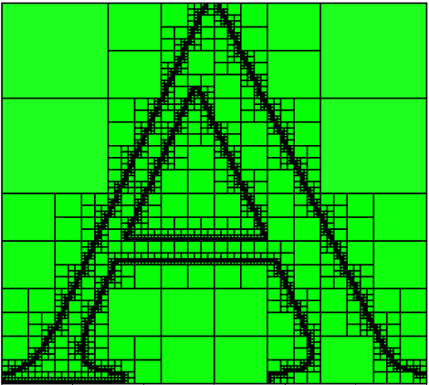
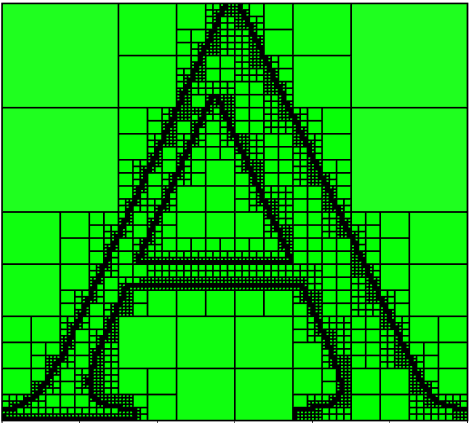

# Generate a balanced Quadtree Mesh

## Overview

This work implements the balanced mesh generation algorithm introduced by Fabrice Jaillet and Claudio Lobos in the paper - "Fast Quadtree/Octree adaptive meshing and re-meshing with linear mixed elements". It processes a `.poly` file to generate a balanced quadtree mesh. The method focuses on using quadrants for meshing, refining in areas of interest, and balancing the mesh as prescribed by the algorithm in the paper. This work was conducted under the guidance of Prof. Kevin Godineau at ENS Paris-Saclay, Department of Mechanical Engineering.

## How It Works

 ### Initialization :
- Sets up global variables, including counters for nodes and quadrants, maximum refinement level, and structures to hold quadrants that need balancing.
```matlab
maxRL = 8;
to_balance = {};
allQuadrants = {};
```
 ### File Reading and Domain Setup :
 ```matlab
fid = fopen(filename, 'r');
```
-  Opens the specified `.poly` file, reading vertex and segment data to understand the domain's layout. It ignores comments and irrelevant lines.  
 ### Boundary Tracing :
 ```matlab
function boundaries = findBoundaries(segments, vertices)
```
- Identifies outer and inner boundaries of the domain and reorders vertices.  
 ### Quadrant Initialization :
 ```matlab
function quadrant = initializeQuadrant(vertices)
```
- Initializes the first quadrant to cover the entire domain and then recursively subdivides it.
- After reading the .poly file and storing its data, we proceed to plot our domain and intialize the mesh.

### Recursive refinement :
 ```matlab
function refineQuadrant(quadrant, currentRL, segments, vertices)
```
- After intializing the mesh, the function proceeds to refine the quadrants in the specified refinement region, which is the domain's boundaries  
 ### Intersection Checking :
  ```matlab
function intersect = doIntersect(p1, q1, p2, q2)
```
- Each edge of the quadrant is checked for intersection with the domain boundaries to decide further subdivision.  
 ### Balancing the Mesh :
  ```matlab
function balanceQuadrants(segments, vertices)
```
- After the initial refinement, the algorithm balances the mesh by ensuring that adjacent quadrants don't have significantly different refinement levels.  
 ### Visualization :
  ```matlab
function plotQuadrant(quadrant, isInside)
```
- Utilizes MATLAB's plotting capabilities to visualize the initial domain and the refined quadrants, aiding in understanding and validating the refinement process.  

## Usage

 **Preparation**:
- Place the script and the `.poly` file representing your domain in the same directory.
 **Execution**:
 Run the script in MATLAB. It will automatically read the domain, perform the refinements, and display the results.
 **Customization**:
- Modify global variables, like maximum refinement level (`maxRL`), to adapt the script's behavior according to different domains or refinement needs.

## Examples

The following input generates the meshes shown in the images:

`maxRL = 8`

### Unbalanced Mesh 


### Balanced Mesh



## Dependencies and Environment

- **MATLAB**: The entire script is written for and requires MATLAB to execute.
- **.Poly File**: A properly formatted `.poly` file representing the domain is necessary for the script to function.

## Contributions and License

The script is open for contributions, and users are encouraged to fork, modify, and improve the code via pull requests. It is shared under the MIT License, promoting open-source usage and distribution.

This detailed overview provides a comprehensive understanding of the Quadrant Refinement Algorithm, its mechanics, usage, and customization, guiding users and developers in leveraging and contributing to this tool.
